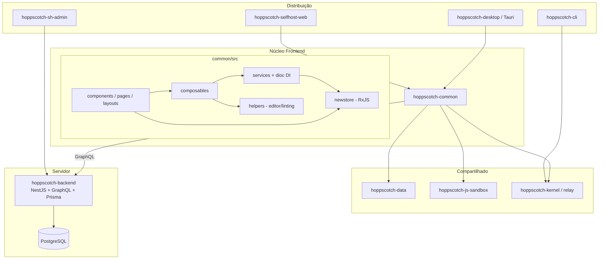

# Arquitetura do Hoppscotch

> Documento do Caminho de Arquitetura e Modelagem — CSI410 (UFOP).
> Projeto analisado: [Hoppscotch](https://github.com/hoppscotch/hoppscotch) — ecossistema open source de desenvolvimento de APIs (alternativa ao Postman).

## 1. Visão geral

O Hoppscotch é organizado como um **monorepo** gerenciado por `pnpm workspaces`
(ver `pnpm-workspace.yaml` e `package.json` na raiz). Cada capacidade do
produto vive em um pacote isolado dentro de `packages/`, o que favorece
**separação de responsabilidades** e **reuso** entre as diferentes formas de
distribuição (web self-host, desktop, CLI, admin).

| Pacote | Responsabilidade | Stack principal |
|---|---|---|
| `hoppscotch-common` | Núcleo da aplicação (UI, estado, lógica de requisições) | Vue 3 (Composition API), Vite, TailwindCSS |
| `hoppscotch-selfhost-web` | Empacota a `common` como app web self-hosted | Vite |
| `hoppscotch-desktop` | App desktop | Tauri (Rust) + `common` |
| `hoppscotch-sh-admin` | Painel administrativo do self-host | Vue 3 |
| `hoppscotch-backend` | API/servidor | NestJS + GraphQL + Prisma |
| `hoppscotch-data` | Esquemas de dados versionados e migrações | TypeScript, Zod |
| `hoppscotch-js-sandbox` | Execução isolada de scripts de pré-request/testes | JS sandbox |
| `hoppscotch-kernel` / `hoppscotch-relay` | Camada de execução de requisições (kernel) e proxy nativo | TypeScript / Rust |
| `hoppscotch-cli` | Execução de coleções via linha de comando | TypeScript |
| `codemirror-lang-graphql` | Suporte de linguagem GraphQL para o editor | CodeMirror 6 |

## 2. Estilo arquitetural

O sistema combina **três estilos** complementares:

1. **Arquitetura em camadas / componentes (frontend `hoppscotch-common`)**
   Dentro de `packages/hoppscotch-common/src/` as responsabilidades estão
   separadas por diretório:

   - `components/` — componentes de apresentação Vue (camada de View).
   - `composables/` — lógica reutilizável de UI (hooks da Composition API).
   - `services/` — serviços de domínio/estado, resolvidos por **injeção de
     dependência** com a biblioteca `dioc`.
   - `newstore/` — estado global reativo baseado em **streams RxJS**
     (padrão Observer).
   - `helpers/` — utilidades puras (parsing, editor, linting, etc.).
   - `platform/` — abstração das diferenças entre plataformas (web/desktop).
   - `pages/` + `layouts/` — roteamento e composição de telas.

2. **Injeção de dependência via container (`dioc`)**
   Serviços como `RESTTabService`, `InspectionService`,
   `SecretEnvironmentService` são registrados e resolvidos por um container,
   promovendo baixo acoplamento e testabilidade (aproxima-se do princípio de
   **Inversão de Dependência** do SOLID).

3. **Cliente/servidor com API GraphQL (backend `hoppscotch-backend`)**
   O backend segue a arquitetura modular do **NestJS** (módulos, controllers,
   resolvers, guards, interceptors), com persistência via **Prisma** e
   comunicação em tempo real via **PubSub/GraphQL subscriptions**.

## 3. Fluxo de dados (frontend)

A View (componentes Vue) lê e escreve estado através de:
- **composables** (ex.: `useCodemirror`, `useVModel`) para lógica de UI, e
- **services/newstore** para estado compartilhado e reativo.

As mudanças de estado propagam-se de volta à View por **reatividade do Vue** e
por **streams RxJS** (Observer), fechando o ciclo unidirecional
View → composable/service → estado → View.

## 4. Diagrama de componentes (Mermaid)

## 5. Justificativa

- O **monorepo** permite compartilhar `hoppscotch-common` entre web, desktop e
  admin sem duplicação, reduzindo custo de manutenção.
- A separação **components / composables / services / newstore** aplica o
  princípio de **Responsabilidade Única (SRP)** em nível de camada: a UI não
  conhece detalhes de estado global nem de execução de requisições.
- O uso de **DI (`dioc`)** e de **streams (RxJS)** desacopla produtores e
  consumidores de estado, o que é essencial num app com muitos painéis
  reagindo às mesmas fontes (ambientes, abas, respostas).

> **Relação com o trabalho:** a issue tratada no Caminho A (#6339) e as
> refatorações do Caminho B concentram-se na camada
> `helpers/editor` + `composables` do `hoppscotch-common`, exatamente onde o
> editor de código (CodeMirror) integra-se ao estado reativo.
